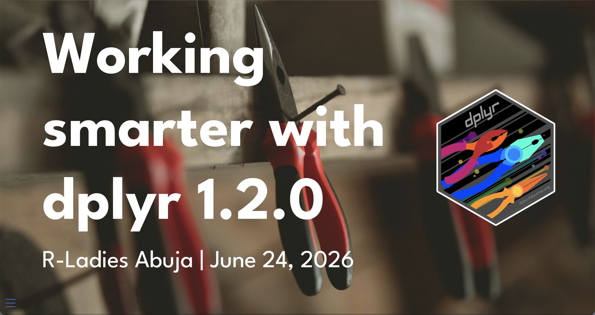

# Working smarter with dplyr 1.2.0

## Details

<ul style="list-style-type: none; padding-left: 0;">
  <li>👥 <a href="https://www.meetup.com/rladies-abuja/events/315092217/">R-Ladies Abuja</a></li>
  <li>📆 24 June 2026 // 06:00 PM WAT</li>
  <li>💻️ Virtual</li>
</ul>

## Description

{dplyr} 1.2.0 is out, and wow, is it a delight!

Join us for a tour of the new tools in {dplyr} 1.2.0 and when you should use them.

We will walk through WHEN you should use ANY of the new functionality (there are new `when_any()` and `when_all()` functions), how to say goodbye to case_match() and what to REPLACE it with, and more. You won't want to `filter_out()` this release. Join us to learn more!

<h2><a href="https://ivelasq.github.io/2026-06-24_dplyr-1-2-0/" target="_blank" rel="noopener noreferrer">
  Slides ↗
</a></h2>

Peruse the presentation slides.

## Resources

* [tidyverse.org](https://tidyverse.org)
* [dplyr](https://dplyr.tidyverse.org)
* [dplyr 1.2.0 blog post](https://tidyverse.org/blog/2026/02/dplyr-1-2-0/)
* [dplyr performance blog post](https://tidyverse.org/blog/2026/02/dplyr-performance/)
* [Libby's LinkedIn post](https://www.linkedin.com/posts/libbyheeren_rstats-activity-7343291858275487744-XlPl/?rcm=ACoAAAy7IywB2qfaREGGoCca5XkthJ2hLjru6ts)
* [Tidyups repo](https://github.com/tidyverse/tidyups)
* [Crystal Lewis blog post](https://cghlewis.com/blog/dplyr_update/)
* [Data Science Lab YouTube playlist](https://www.youtube.com/watch?v=zYCAz88WjHc&list=PL9HYL-VRX0oSeWeMEGQt0id7adYQXebhT)
* [quarto-revealjs-editable extension by Emil Hvitfeldt](https://github.com/EmilHvitfeldt/quarto-revealjs-editable)
* [tidy-animations by Emil Hvitfeldt](https://emilhvitfeldt.github.io/tidy-animations/)
