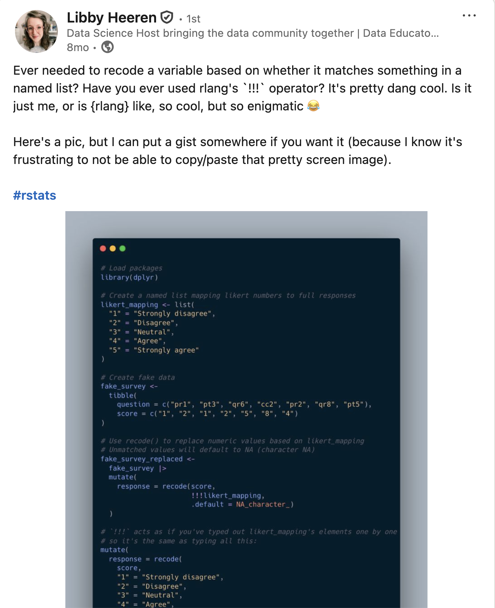
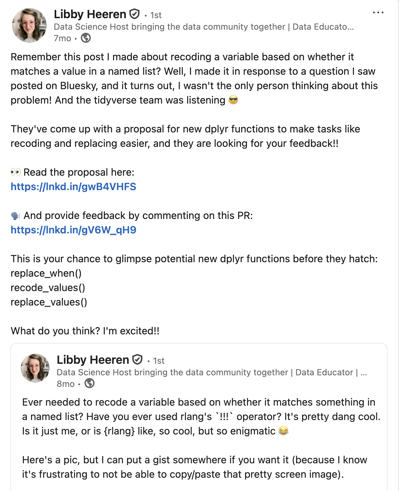

```{r}
#| include: false
#| label: setup
library(dplyr)
library(tidyr)
library(palmerpenguins)

penguins_data <- penguins
```

## Introduction

<center>

{width=20%}

[ \@ivelasq3](https://bsky.app/profile/ivelasq3.bsky.social)

[ \@ivelasq](https://github.com/ivelasq)

[ \@ivelasq](https://linkedin.com/in/ivelasq/)

[ ivelasq.rbind.io](https://ivelasq.rbind.io)

</center>

## Introduction

⬢ Slides available at: [ivelasq-abuja-dplyr-1-2-0.share.connect.posit.cloud](ivelasq-abuja-dplyr-1-2-0.share.connect.posit.cloud)

⬢ Links available at the end of the slide deck

# dplyr {background-color=''}

## {background-image="images/tidyverse.png"}

::: footer
[tidyverse.org](https://tidyverse.org)
:::

##

[dplyr]{style="font-size: 80px;"} [is a grammar of data manipulation,]{.fragment style="color: blue; font-size: 80px;"} [providing a consistent set of verbs]{.fragment style="color: darkorange; font-size: 80px;"} [that help you solve]{.fragment style="font-size: 80px;"} [the most common data manipulation challenges]{.fragment style="color: red; font-size: 80px;"}

# dplyr 1.2.0 {background-color=''}

## {background-image="images/dplyr-blog-post.png"}

::: footer
[dplyr 1.2.0 blog post](https://tidyverse.org/blog/2026/02/dplyr-1-2-0/)
:::

## dplyr functions

So many helpful functions!

:::: {.columns}

::: {.column}

⬢ `distinct()`

⬢ `slice()`

⬢  `count()`

⬢  `pull()`

⬢  `relocate()`

⬢  `rename()`

⬢  `*_join()`

⬢  ...

:::

::: {.column .fragment}

But for now, let's focus on:

⬢ `filter()`

⬢ `mutate()` + `case_when()`

:::

::::

::: footer
[dplyr.tidyverse.org](https://dplyr.tidyverse.org/)
:::

# Expanding the `filter()` family {background-color=''}

## Quick review of `filter()` {.fr-slide}

`filter()` picks cases based on their values



::: footer
Image generated by [tidy extensions](https://emilhvitfeldt.github.io/tidy-animations/#data-wrangling-dplyr)
:::

## Quick review of `filter()` {.fr2-slide}

`filter()` picks cases based on their values



::: footer
Image generated by [tidy extensions](https://emilhvitfeldt.github.io/tidy-animations/#data-wrangling-dplyr)
:::


# The problems with using `filter()` to exclude {background-color="#99ccff"}

## `filter()` is ambiguous!

```r
monthly_losses_data |>
  filter(island == "Torgersen")
```

. . .

Are you *keeping* (filtering in) Torgersen or *dropping* (filtering out) Torgersen?


## `filter()` is optimized for keeping rows, but dropping rows can require complex logic {.fp-slide}

Example: Drop rows where island is Torgersen and body mass is greater than 4000g.



. . .

Using `filter()` with negation drops BOTH the target row AND rows with `NA`!

::: footer
Image generated by [tidy extensions](https://emilhvitfeldt.github.io/tidy-animations/#data-wrangling-dplyr)
:::

## The problem with using `filter()` to exclude

To properly use `filter()`, we would need to do something like:

```{r}
#| echo: true
#| eval: false
penguins_NA |>
  filter(
    !((island == "Torgersen" & !is.na(island)) &
             (body_mass_g > 4000 & !is.na(body_mass_g)))
    )
```

# Work smarter with `filter_out()`! {background-color=''}

## Work smarter with `filter_out()` {.fo-slide}

`filter_out()` drops rows where ALL conditions match (keeps NAs!)



::: footer
Image generated by [tidy extensions](https://emilhvitfeldt.github.io/tidy-animations/#data-wrangling-dplyr)
:::

# Demo {background-color=''}

## When to use `filter()` vs `filter_out()`

:::: {.columns}

::: {.column width="50%"}

Use `filter()` to **keep** rows

```r
penguins |>
  filter(species == "Adelie")
```

✅ Positive logic

✅ What you want to keep

:::

::: {.column width="50%"}

Use `filter_out()` to **drop** rows

```r
penguins |>
  filter_out(species == "Adelie")
```

✅ Negative logic

✅ What you want to exclude

:::

::::

. . .

**Rule of thumb:** If you're using `!` in your `filter()`, consider `filter_out()` instead!

# Issues with `filter()` and `|` {background-color="#99ccff"}

## Confusing logic statements  {.for-slide}

```{r}
#| include: false
# Sample dataset with different species and islands
penguins_filters <- penguins |>
  filter(species %in% c("Adelie", "Gentoo")) |>
  select(species, island, body_mass_g) |>
  group_by(species) |>
  slice(1:4) |>
  ungroup()
```

Keep rows where Adelie penguins from Torgersen have body mass over 3700g OR where Gentoo penguins have body mass over 5000g.



::: footer
Image generated by [tidy extensions](https://emilhvitfeldt.github.io/tidy-animations/#data-wrangling-dplyr)
:::

# Work smarter with `when_any()` and `when_all()`! {background-color=''}

## Work smarter with `filter()` + `when_any()` example {.was-slide}

`when_any()` cleanly expresses OR logic - keeps rows matching at least one condition



::: footer
Image generated by [tidy extensions](https://emilhvitfeldt.github.io/tidy-animations/#data-wrangling-dplyr)
:::

## Work smarter with `filter()` + `when_any()` {.wa-slide}

More powerful when you have complex combinations to keep



::: footer
Image generated by [tidy extensions](https://emilhvitfeldt.github.io/tidy-animations/#data-wrangling-dplyr)
:::

## Work smarter with `filter()` + `when_all()` {.wal-slide}

`when_all()` cleanly expresses AND logic - keeps only rows matching ALL conditions



::: footer
Image generated by [tidy extensions](https://emilhvitfeldt.github.io/tidy-animations/#data-wrangling-dplyr)
:::

## Layering `when_any()` + `when_all()` {.wn-slide}

The real power: nest `when_all()` inside `when_any()` for complex logic!



::: footer
Image generated by [tidy extensions](https://emilhvitfeldt.github.io/tidy-animations/#data-wrangling-dplyr)
:::

# Demo {background-color=''}

## When to use `when_any()` vs `when_all()`

:::: {.columns}

::: {.column width="50%"}

Use `when_any()` for **OR** logic

```r
penguins |>
  filter(when_any(
    species == "Adelie",
    body_mass_g > 5000
  ))
```

✅ At least one condition must be true

✅ Cleaner than nested `|` operators

:::

::: {.column width="50%"}

Use `when_all()` for **AND** logic

```r
penguins |>
  filter(when_all(
    species == "Gentoo",
    body_mass_g > 5000
  ))
```

✅ All conditions must be true

✅ Useful when nesting inside `when_any()`

✅ For simple AND, just use commas!

:::

::::

. . .

**Rule of thumb:** If you have complex `|` or `&` expressions in your `filter()`, consider `when_any()` and `when_all()`!

# Reaching recoding nirvana {background-color=''}

## Quick review of `mutate()` {.ms-slide}

`mutate()` adds new columns or modifies existing ones



## Quick review of `mutate()` + `case_when()` {.cw-slide}

`case_when()` evaluates conditions in order and creates a new column




## `case_when()` and unmatched rows {.cwu-slide}

Unmatched rows default to `NA`



# Issues with `case_when()` {background-color="#99ccff"}

## `case_when()` wasn't meant to recode values {.cwi-slide}

`case_when()` evaluates multiple conditions to recode island names to locations



# Work smarter with `recode_values()`! {background-color=''}

## Use `recode_values()` when *recoding* and matching with *values* {.rv-slide}

`recode_values()` matches exact values and recodes them to new values



## Use `recode_values()` when *recoding* and matching with *values* {.rve-slide}

With `unmatched = "error"`, operation stops on first unmatched value



## Using `recode_values()` and a lookup table {.rvl-slide}

The lookup table provides the mapping from old values to new values



# Demo {background-color=''}

## When to use `recode_values()` {.smaller}

:::: {.columns}

::: {.column width="50%"}

Use `case_when()` for **conditions**

```r
penguins |>
  mutate(size = case_when(
    body_mass_g > 4500 ~ "Large",
    body_mass_g < 3500 ~ "Small",
    .default = "Medium"
  ))
```

✅ Complex logical conditions

✅ Comparing values with `>`, `<`, `>=`, etc.

:::

::: {.column width="50%"}

Use `recode_values()` for **exact matches**

```r
penguins |>
  mutate(location = island |>
    recode_values(
      "Biscoe" ~ "Southwest",
      "Dream" ~ "Northwest",
      "Torgersen" ~ "Northwest"
    ))
```

✅ Simple `==` equality checks

✅ Many values to recode

✅ Can use a lookup table!

:::

::::

. . .

**Rule of thumb:** If you're using `==` in `case_when()`, consider `recode_values()` instead!

## New `replace_values()` function {.repval-slide}

`replace_values()` replaces specific values (no need for `.default`)



## New `replace_when()` function {.rw-slide}

`replace_when()` replaces values based on a condition (no `.default` needed!)



## When to use `replace_*()` {.smaller}

:::: {.columns}

::: {.column width="50%"}

Use `case_when()`/`recode_values()` to **create** a new column

```r
penguins |>
  mutate(size = case_when(
    body_mass_g > 4500 ~ "Large",
    body_mass_g < 3500 ~ "Small",
    .default = "Medium"
  ))
```

✅ Building a new variable from scratch

✅ Multiple outcomes based on conditions

✅ Requires `.default` for unmatched cases

:::

::: {.column width="50%"}

Use `replace_*()` to **modify** an existing column

<br>

```r
penguins |>
  mutate(body_mass_g =
    replace_when(body_mass_g,
      body_mass_g > 5000 ~ 5000
    ))
```

✅ Replacing specific values in a column

✅ Unmatched values stay unchanged

✅ No `.default` needed!

:::

::::

. . .

**Rule of thumb:** If you want to modify some values but keep the rest, use `replace_*()` instead of `case_when()`/`recode_values()` with `.default`!

# Additional thoughts {background-color=''}

##

::: {.r-fit-text}

`case_match()` has been soft deprecated

{.absolute width=587px height=587px left=239.5px top=97.6px}

:::

## {background-image="images/vctrs.png"}

::: footer
[dplyr performance blog post](https://tidyverse.org/blog/2026/02/dplyr-performance/)
:::

## Updating your LLM

- Paste documentation into the conversation
- Add a CLAUDE.md or SKILL.md file to your project
- Point it to the docs
- Use an MCP server

## Community feedback is sooo important

<center><blockquote class="bluesky-embed" data-bluesky-uri="at://did:plc:w3xfmczr7oyc2mlpwoquwype/app.bsky.feed.post/3m52hcf6l4s2h" data-bluesky-cid="bafyreiebx6quo3rgvnseqgos2nrwckk6b5xha5lepgjs3dz5y4weslzlji" data-bluesky-embed-color-mode="system"><p lang="en">We are looking for #rstats community feedback on 3 new dplyr functions!

We&#x27;re aiming to expand the `filter()` family:

- `filter()` to keep rows
- `filter_out()` to drop rows
- `when_any()` and `when_all()` as modifiers

Read more and leave feedback here:
github.com/tidyverse/ti...<br><br><a href="https://bsky.app/profile/did:plc:w3xfmczr7oyc2mlpwoquwype/post/3m52hcf6l4s2h?ref_src=embed">[image or embed]</a></p>&mdash; Davis Vaughan (<a href="https://bsky.app/profile/did:plc:w3xfmczr7oyc2mlpwoquwype?ref_src=embed">@davisvaughan.bsky.social</a>) <a href="https://bsky.app/profile/did:plc:w3xfmczr7oyc2mlpwoquwype/post/3m52hcf6l4s2h?ref_src=embed">November 7, 2025 at 10:03 AM</a></blockquote><script async src="https://embed.bsky.app/static/embed.js" charset="utf-8"></script></center>

## {background-image="images/tidyups.png"}

::: footer
[Tidyups repo](https://github.com/tidyverse/tidyups)
:::

## Community feedback is sooo important

:::: {.columns}

::: {.column}



:::

::: {.column}


:::

::::


# Summary {background-color=''}

## Rules of thumb

⬢ Use `filter()` to keep rows

⬢ Use `filter_out()` to drop rows (if you're using `!` in `filter()`)

⬢ Use `when_any()` for **OR** logic (if you have complex `|` expressions)

⬢ Use `when_all()` for **AND** logic (useful when nesting inside `when_any()`)

⬢ Use `recode_values()` for exact matches (if you're using `==` in `case_when()`)

⬢ Use `replace_*()` to modify some existing columns

## Installing dplyr 1.2.0

Upgrade today!

```r
install.packages("pak")
pak::pak("dplyr")
```

{.absolute width=424px height=424px left=585px top=238.4px}

# Thank you {background-color=''}

## Acknowledgements

* Davis Vaughan and the tidyverse team
* Libby Heeren for her awesome example
* Emojis from [OpenMoji](https://openmoji.org/library/)
* Photo from Unsplash

## Links {.smaller}

* [tidyverse.org](https://tidyverse.org)
* [dplyr](https://dplyr.tidyverse.org)
* [dplyr 1.2.0 blog post](https://tidyverse.org/blog/2026/02/dplyr-1-2-0/)
* [dplyr performance blog post](https://tidyverse.org/blog/2026/02/dplyr-performance/)
* [Libby's LinkedIn post](https://www.linkedin.com/posts/libbyheeren_rstats-activity-7343291858275487744-XlPl/?rcm=ACoAAAy7IywB2qfaREGGoCca5XkthJ2hLjru6ts)
* [Tidyups repo](https://github.com/tidyverse/tidyups)
* [Crystal Lewis blog post](https://cghlewis.com/blog/dplyr_update/)
* [Data Science Lab YouTube playlist](https://www.youtube.com/watch?v=zYCAz88WjHc&list=PL9HYL-VRX0oSeWeMEGQt0id7adYQXebhT)
* [quarto-revealjs-editable extension by Emil Hvitfeldt](https://github.com/EmilHvitfeldt/quarto-revealjs-editable)
* [tidy-animations by Emil Hvitfeldt](https://emilhvitfeldt.github.io/tidy-animations/)
